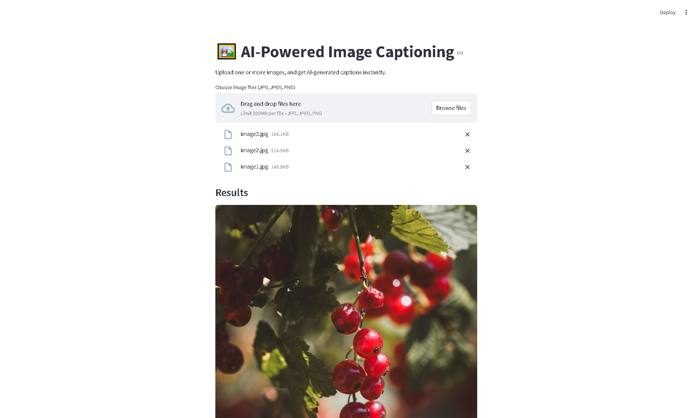

# 🖼️ AI-Powered Image Captioning

Generate accurate and descriptive captions for your images using a powerful AI model from Hugging Face (BLIP).

 

## 🚀 Demo

Upload one or more images through the web interface, and get instant AI-generated captions.  
You can also download all the captions as a `.txt` file.

---

## 🔧 Features

- ✅ Upload multiple JPG/PNG images
- 🧠 Generates captions using [BLIP](https://huggingface.co/Salesforce/blip-image-captioning-base)
- ⚡ Fast and accurate
- 💾 Option to download all captions
- 🌐 Streamlit web interface (no need for command-line!)

---

## 📸 Example

| Input Image | Generated Caption |
|-------------|-------------------|
|  | A cat sitting on a windowsill looking outside. |

---

## 🛠️ How to Run

### 1. Clone the repository

```bash
git clone https://github.com/yourusername/ai-image-captioning.git
cd ai-image-captioning
```
### 2. Set up the environment

```bash
python -m venv venv
venv\Scripts\activate  # On Windows
# source venv/bin/activate  # On Mac/Linux

pip install -r requirements.txt
```

### 3. Start the app

```bash
streamlit run app.py
```

## 📦 Dependencies

- `transformers`

- `torch`

- `streamlit`

- `Pillow`

Install them all with:
```bash
pip install -r requirements.txt
```

## 🤖 Model Used

[BLIP: Bootstrapping Language-Image Pre-training](https://huggingface.co/Salesforce/blip-image-captioning-base)

## 🙌 Credits

Created by DeepSynthAI
Powered by Hugging Face + Streamlit

## 📄 License

MIT License

```bash

---

### ✅ Final Touches

1. Add a **preview screenshot** of the app running (save it as `preview.png`)
2. If you want, add a sample image like `example.jpg` in the README table
3. Add a `requirements.txt` file:

```txt
transformers
torch
streamlit
Pillow
```

